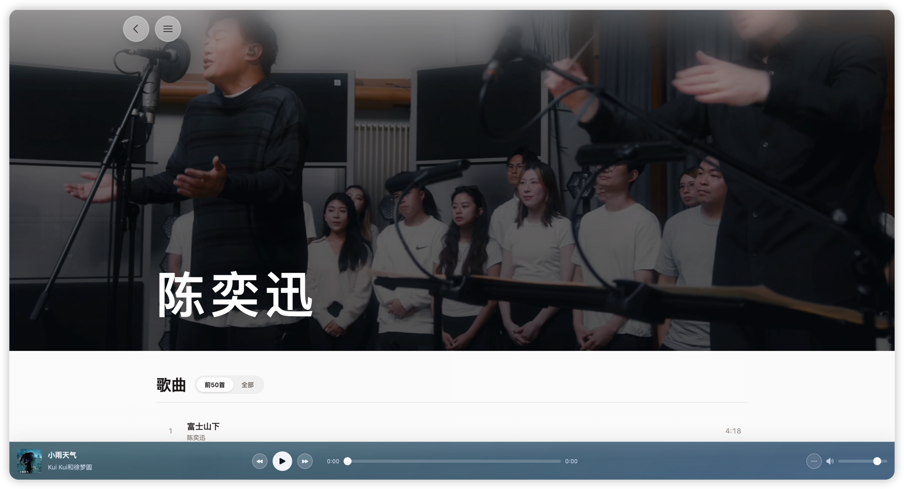
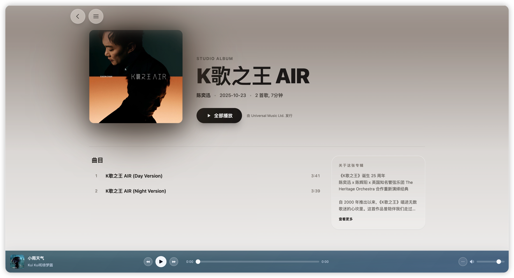
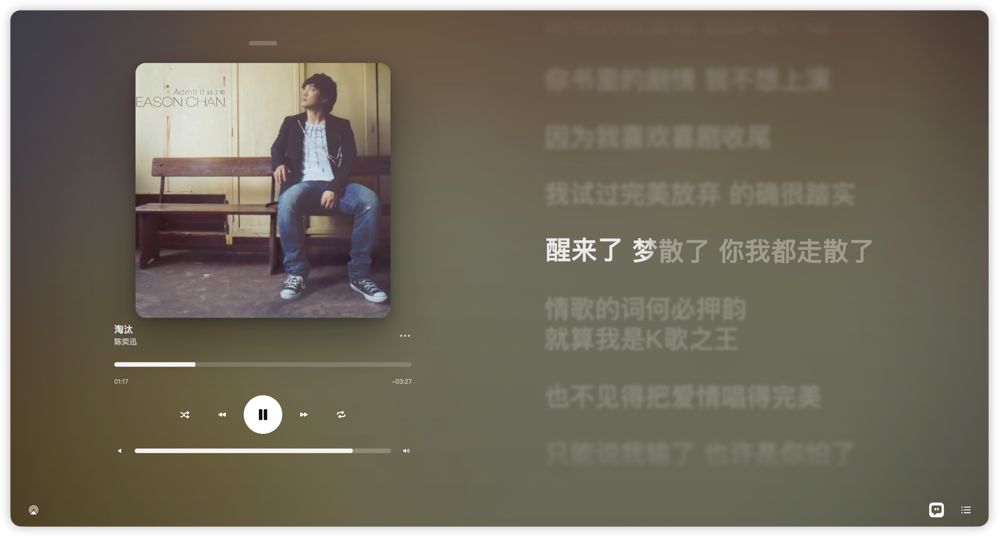

# AuroraPlayer

AuroraPlayer 是一个基于 Vue 3 + Vite 的音乐 Web 应用，目标是把「发现 -> 搜索 -> 播放 -> 详情浏览 -> 账号能力」做成一条完整链路。






## 近期新增功能

- 智能混音播放器：新增 Rust + WASM 自动混音引擎（选曲推荐、过渡点规划、双 Deck Crossfade）
- 动态封面联动：歌曲支持动态封面拉取，播放器封面过渡与下一首预热
- 悬浮搜索重构：支持歌手/歌曲/歌单并行搜索、意图识别、键盘导航、分区分页
- 首页内容升级：新增最近听歌分页、MV 多来源切换（全部/最新/网易出品/推荐）和清晰度切换
- 更新日志能力：新增 `/release-notes` 页面，并支持首页侧滑更新日志面板
- 账号能力增强：新增二维码登录、消息中心（通知 + 私信）、私信会话与发送
- 个人中心扩展：新增云盘歌曲管理（上传/播放/详情/删除）与听歌画像可视化
- 交互体验升级：新增全局返回手势（键盘/鼠标侧键/边缘滑动）与歌单 Hero 转场

## 核心功能

- 首页聚合：Banner、推荐歌单、网友精选碟、新歌、最近听歌、榜单、播客、MV、热门艺人
- 全局播放器：跨路由播放、队列管理、播放模式切换、音量控制、歌词页联动
- 歌词体验：集成 `@applemusic-like-lyrics`（Vue 绑定）
- 内容详情页：歌单详情、歌手详情、专辑详情
- 用户系统：扫码登录、消息中心、个人页
- 状态持久化：Pinia + persistedstate 持久化播放器与用户关键状态

## 技术栈

- 框架：`Vue 3`
- 构建：`Vite`（`rolldown-vite`）
- 路由：`Vue Router 4`
- 状态管理：`Pinia` + `pinia-plugin-persistedstate`
- UI：`Tailwind CSS 4`、`Headless UI`、`Heroicons`、`Ant Design Vue`
- 动画：`GSAP`、`Motion`
- 多媒体：`Three.js`、`Pixi.js`、`Chroma.js`、`ColorThief`
- 请求层：`Axios`
- 混音引擎：Rust + WebAssembly（位于 `src/wasm/automix`）

## 项目结构

```text
.
├─ src/
│  ├─ api/                     # 接口封装（歌曲、歌单、用户、搜索等）
│  ├─ axios/                   # 请求实例与拦截器
│  ├─ components/              # 组件（播放器、搜索、弹层、媒体组件等）
│  ├─ stores/                  # Pinia 状态
│  ├─ utils/                   # 工具（全局播放、automix、转场等）
│  ├─ view/                    # 页面（home、artist、album、playlist、profile）
│  ├─ wasm/automix/            # Rust/WASM 自动混音引擎
│  ├─ router/
│  ├─ App.vue
│  └─ main.js
├─ .env.example
├─ vite.config.js
├─ package.json
└─ README.md
```

## 快速开始

### 1) 环境要求

- Node.js：`^20.19.0 || >=22.12.0`
- npm：建议 `>= 10`

### 2) 安装依赖

```bash
npm install
```

### 3) 配置环境变量

```bash
cp .env.example .env.local
```

修改 `.env.local`：

- `VITE_API_BASE_URL`：默认 `/api`
- `VITE_ADMIN_API_BASE_URL`：默认 `/backend-api`
- `VITE_API_PROXY_TARGET`：开发代理到音乐 API 服务
- `VITE_ADMIN_API_PROXY_TARGET`：开发代理到自建后端

### 4) 启动开发环境

```bash
npm run dev
```

默认访问地址：

- 本机：`http://localhost:5173`
- 局域网：`http://<你的IP>:5173`

## 常用命令

```bash
npm run dev
npm run build
npm run preview
npm run lint
```

## 接口与代理说明

项目有两条请求链路：

1. `apiClient`
   - `baseURL` 来自 `VITE_API_BASE_URL`（默认 `/api`）
   - 开发环境由 Vite 代理到 `VITE_API_PROXY_TARGET`

2. `requestLocal`
   - `baseURL` 来自 `VITE_ADMIN_API_BASE_URL`（默认 `/backend-api`）
   - 开发环境由 Vite 代理到 `VITE_ADMIN_API_PROXY_TARGET`
   - 当前用于 `banner`、`release-notes` 等自有接口

## 构建与部署

```bash
npm run build
```

构建产物为 `dist/`，可部署到任意静态服务器（Nginx、Vercel、Netlify 等）。

## 开源许可证

本项目采用 `GNU Affero General Public License v3.0`（`AGPL-3.0-only`）。

- 可在 AGPL 条款下使用、修改、再分发
- 若将本项目（含修改版）用于网络服务，需要向该服务用户提供对应源码
- 完整协议请查看 `LICENSE`

## 贡献

欢迎提交 Issue / PR。

- 提交前请先运行 `npm run lint`
- 涉及 UI 变更建议附截图
- 涉及配置改动请同步更新文档和 `.env.example`

## 致谢

- JetBrains WebStorm
- `amll-dev/applemusic-like-lyrics`：<https://github.com/amll-dev/applemusic-like-lyrics>

---

如果这个项目对你有帮助，欢迎点个 Star。
