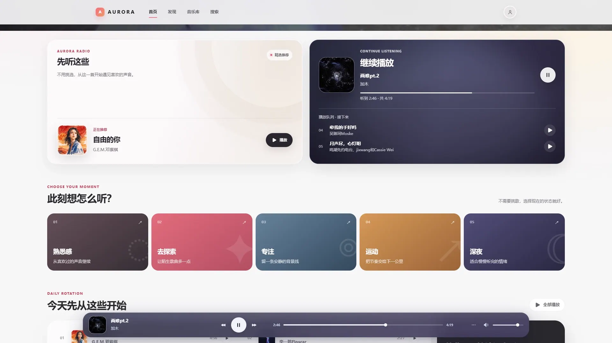
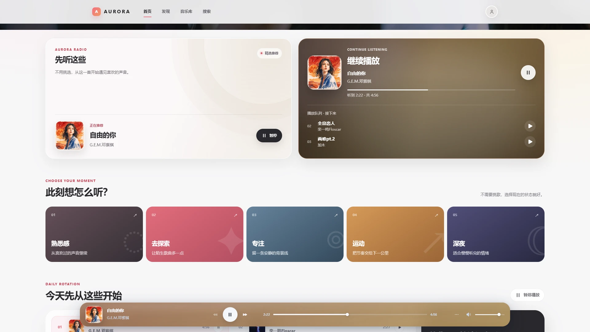
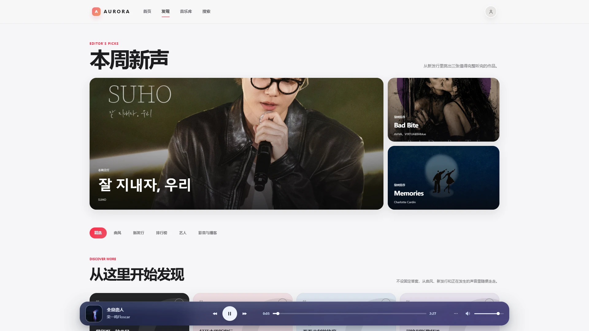
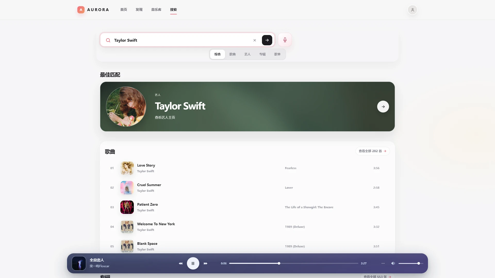
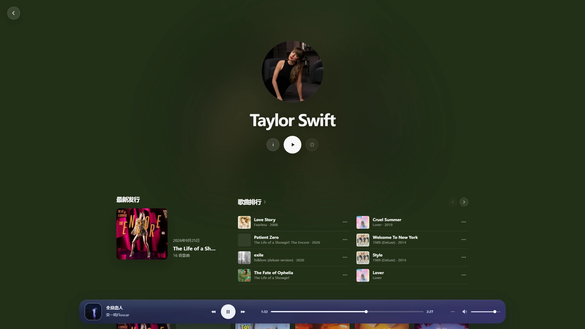
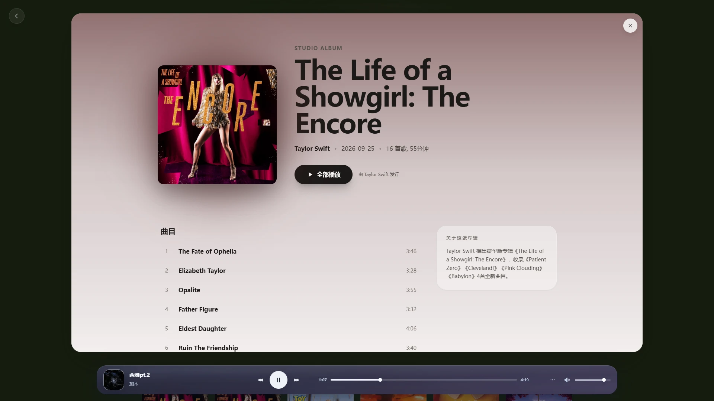

# AuroraPlayer

**让封面、歌词和音乐一起流动。**

AuroraPlayer 是一个注重全屏播放体验与视觉动效的音乐 Web 应用。它把音乐发现、搜索、内容详情与个人音乐库连接起来，也把封面取色、流体背景、歌词滚动和播放器转场放进同一段听歌体验中。

[在线体验](https://music.xiaojunjunjun.com/) · [源码仓库](https://gitee.com/zhangxiaojunjun/AuroraPlayer) · [本地运行](#本地运行) · [部署说明](#部署说明)


> 本文截图和动图来自线上站点，采集于 2026-10-09，分辨率均为 **1920 × 1080**。静态截图在主要内容与可见媒体加载完成后拍摄；推荐内容会随时间和账号变化。

## 全屏播放，把注意力交给音乐

点击底部播放器的封面，即可进入全屏歌词界面。桌面端将封面与播放控制放在一侧，歌词放在另一侧；窄屏会切换为纵向布局。浏览页面时，底部播放器持续保留当前歌曲、播放进度和队列。

- **跟随歌曲变化的背景**：从封面延伸出柔和的主题色与流体背景，配合音乐低频分析传递节奏变化；具备动态封面资源的歌曲还可以展示视频封面。
- **跟随播放推进的歌词**：当前歌词突出显示，相邻歌词通过位移、模糊和透明度形成层次。支持 LRC 与 YRC 等歌词数据；有逐字时间信息时呈现逐字高亮，普通歌词按行同步。
- **连续的进入与退出**：底部播放器与全屏界面通过封面位置、尺寸和圆角的过渡建立联系，展开后继续播放，收起后回到原来的浏览上下文。
- **完整的播放操作**：播放 / 暂停、上一首 / 下一首、进度拖动、音量、随机播放、单曲循环、播放队列与歌词显隐。点击歌词可跳转到对应的播放位置。
- **继续上次的音乐**：保存当前歌曲、队列及播放进度，刷新后可继续听；通过 Media Session 对接浏览器与系统支持的媒体控制。

全屏歌词界面基于 [Apple Music-like Lyrics](https://github.com/amll-dev/applemusic-like-lyrics) 构建，由 Vue 应用桥接 React 播放器；歌曲资源、全局播放状态、动态封面与进入退出转场由 AuroraPlayer 接入和管理。

## 动效预览

下面是线上站点的真实录屏：从底部播放器展开到全屏歌词，歌词与背景随播放变化，再收起回到首页。动图保留 1080p 分辨率，无音轨。



动效贯穿内容浏览和播放操作，让界面变化有可跟随的路径：

| 交互 | 视觉表现 |
| --- | --- |
| 进入 / 收起全屏播放器 | 封面在底部播放器与全屏布局之间移动，尺寸、圆角与界面层次连续过渡 |
| 播放与切歌 | 歌曲信息切换、封面过渡与主题色变化；预热下一首的封面资源 |
| 打开歌单或专辑 | 从内容卡片进入详情浮层，支持共享封面 Hero 转场；关闭时恢复背景页面 |
| 浏览歌手主页 | 封面取色的氛围背景；配置了视频海报的歌手可展示动态 Hero |
| 搜索与分类切换 | 搜索栏布局过渡、分类指示器、结果渐入，以及最佳匹配卡片的取色与悬停反馈 |
| 首页内容与卡片 | 内容进入视口时渐进出现，卡片提供悬停与按压反馈 |

页面与外层转场针对系统的 `prefers-reduced-motion` 偏好提供简化路径。流体背景、动态海报与逐字歌词的可用性取决于浏览器能力和对应资源。

## 页面预览

### 首页：从今天想听的声音开始

推荐歌曲、继续播放、接下来的队列、场景电台与精选歌单集中在首页。游客可以浏览公共推荐；登录后可使用每日推荐、私人 FM、最近听歌与个人曲风偏好。



### 发现与搜索

发现页聚合新发行、曲风、排行榜、艺人、MV 与播客。搜索覆盖歌曲、艺人、专辑和歌单，提供综合结果、最佳匹配、分类分页、搜索历史与听歌识曲入口。

| 发现音乐 | 搜索与最佳匹配 |
| --- | --- |
|  |  |

### 艺人与专辑

歌手主页将最新发行、歌曲排行、专辑、音乐视频与介绍整合在一起。歌单和专辑详情支持从当前页面打开浮层，在浏览曲目与介绍时保留背景页面和底部播放器。

| 歌手主页 | 专辑详情浮层 |
| --- | --- |
|  |  |

## 功能概览

| 模块 | 能力 |
| --- | --- |
| 全局播放 | 跨路由播放、队列管理、播放模式、音量、音质选择、播放进度保存、系统媒体控制 |
| 全屏歌词 | 封面与流体背景、同步歌词、逐字高亮、歌词点击跳转、歌词显隐、封面转场 |
| 音乐发现 | 场景电台、推荐歌单、新发行、曲风、榜单、艺人、MV 与播客 |
| 搜索 | 综合与分类搜索、最佳匹配、分页、搜索历史、听歌识曲 |
| 内容详情 | 歌单、专辑、歌手主页，详情浮层与共享封面转场 |
| 账号与音乐库 | 网易云音乐二维码登录、个人歌单、最近听歌、云盘歌曲管理、听歌画像 |
| 消息与动态 | 通知、私信会话与发送、音乐动态浏览 |
| 浏览交互 | 键盘返回、鼠标侧键返回、边缘滑动返回、页面状态与滚动位置恢复 |
| 更新记录 | 更新日志页面与首页侧滑更新面板 |

个人推荐、云盘、消息等功能需要登录，具体可用内容与音质取决于音乐 API 返回结果及账号权限。听歌识曲需要 HTTPS 或 localhost 环境，并由用户授权麦克风访问。

### AutoMix：让下一首接得更自然

AutoMix 是仍在迭代的自动混音能力。它在浏览器端分析音频，结合 BPM、拍点、调性、能量和置信度规划切歌方式，并通过 Web Audio 双 Deck 执行播放转场。

- **后台分析**：Rust / WebAssembly 内核在独立 Worker 中处理音频，分析结果按歌曲、音质和版本缓存在 IndexedDB。
- **有限前瞻**：准备当前曲、下一首与下下首，避免同时分析整个播放列表。
- **转场执行**：支持节拍混合、段落交叉淡化、Loop Bridge、Echo / Filter Out 等策略，配合增益、动态 EQ、Bass Swap 与输出 limiter。
- **能力回退**：分析置信度不足或浏览器不支持所需能力时，回退到基础淡入淡出。

实际效果受歌曲内容、音频资源跨域设置与浏览器能力影响。算法与 WASM 接口说明见 [AutoMix 文档](rust/automix/README.md)。

## 技术实现

| 层次 | 技术 |
| --- | --- |
| 应用与路由 | Vue 3、Vue Router 4、Pinia、持久化状态 |
| 全屏歌词 | AMLL Core / React / React Full、React、Jotai，由 Vue 组件桥接 |
| 界面与样式 | Tailwind CSS 4、Headless UI、Heroicons、Ant Design Vue |
| 视觉动效 | GSAP、Motion、Vue Transition、共享封面 Hero 转场 |
| 图形与主题色 | Three.js、Pixi.js、Canvas、Chroma.js、ColorThief |
| 音频与分析 | Web Audio、AudioWorklet、Web Worker、Rust / WebAssembly、Essentia.js、IndexedDB |
| 请求与构建 | Axios、Vite（rolldown-vite）、npm |

项目中的 AMLL 依赖通过 `vendor/amll/` 下的本地包安装，来源版本、对应源码与许可证记录在 [vendor/amll/README.md](vendor/amll/README.md)。克隆和部署时请保留这些文件。

## 本地运行

### 1. 准备运行环境与后端

- Node.js：`^20.19.0 || >=22.12.0`，建议使用满足要求的 LTS 版本。
- npm：项目记录的包管理器版本为 `11.11.0`。
- 音乐 API：提供 `src/api/` 使用的网易云音乐相关接口，默认代理目标为 `http://127.0.0.1:3000`。
- 自建内容后端：提供 Banner、更新日志、歌手海报等接口，默认代理目标为 `http://127.0.0.1:8080`。

**本仓库包含前端应用与 AutoMix 内核，不包含上述两个后端的实现或部署脚本。** 启动前需自行准备兼容的服务，或将代理目标改为已有服务地址。音乐 API 未配置时，搜索和播放无法完整运行；自建后端未配置时，依赖它的内容可能缺失或显示回退状态。

### 2. 获取代码并安装依赖

```bash
git clone https://gitee.com/zhangxiaojunjun/AuroraPlayer.git
cd AuroraPlayer
npm ci
```

### 3. 创建本地配置

复制仓库中的 [.env.example](.env.example) 为 `.env.local`。

macOS / Linux：

```bash
cp .env.example .env.local
```

Windows PowerShell：

```powershell
Copy-Item .env.example .env.local
```

默认配置：

```dotenv
VITE_API_BASE_URL=/api
VITE_API_PROXY_TARGET=http://127.0.0.1:3000
VITE_ADMIN_API_BASE_URL=/backend-api
VITE_ADMIN_API_PROXY_TARGET=http://127.0.0.1:8080
```

| 配置项 | 用途 |
| --- | --- |
| `VITE_API_BASE_URL` | 浏览器访问音乐 API 的地址前缀，默认 `/api` |
| `VITE_API_PROXY_TARGET` | Vite 开发服务器的音乐 API 代理目标；代理时移除 `/api` 前缀 |
| `VITE_ADMIN_API_BASE_URL` | 浏览器访问自建后端的地址前缀，默认 `/backend-api` |
| `VITE_ADMIN_API_PROXY_TARGET` | Vite 开发服务器的自建后端代理目标；代理时移除 `/backend-api` 前缀 |
| `VITE_API_TIMEOUT` / `VITE_ADMIN_API_TIMEOUT` | 两条请求链路的超时时间，单位毫秒，默认均为 `10000` |
| `VITE_ENABLE_VUE_DEVTOOLS` | 设置为 `true` 时在开发模式启用 Vue DevTools |
| `VITE_AUTOMIX_DEBUG` | 设置为 `true` 时在开发模式开启 AutoMix 调试展示 |

`VITE_*` 变量会进入浏览器端代码，适合配置公开地址与开关。私密 API 密钥应由后端保存；AI 请求优先使用后端代理。修改环境变量后需重启开发服务器，生产环境地址改动后需重新构建。

### 4. 启动开发服务器

```bash
npm run dev
```

默认访问 [http://localhost:5173](http://localhost:5173)。开发服务器允许局域网访问；二维码登录、麦克风识曲与部分音频能力还取决于后端接口和浏览器权限。

## 开发与检查

| 命令 | 作用 |
| --- | --- |
| `npm run dev` | 启动开发服务器 |
| `npm run build` | 构建生产资源到 `dist/` |
| `npm run preview` | 本地预览生产构建 |
| `npm run lint` | 运行 Oxlint 与 ESLint，**包含自动修复，会修改文件** |
| `node --test tests/home.test.mjs tests/song-recognition.test.mjs` | 检查首页数据竞争与缓存、播放进度恢复、识曲录音窗口 |
| `npm run automix:test` | 运行 Rust 混音内核测试，需要 Rust / Cargo |
| `npm run automix:build` | 从 Rust 源码重新生成 WASM，需要 Rust 与 wasm-pack |

浏览器使用的 WASM 产物已提交在 `src/wasm/automix/`，只运行前端时无需安装 Rust。修改 `rust/automix/` 后，应运行内核测试并重新构建 WASM，保持源码与浏览器产物一致。

## 部署说明

```bash
npm run build
```

将 `dist/` 发布到静态服务器，并配置音乐 API 与自建后端的访问路径。Vite 的开发代理不会被打包进静态文件；保留 `/api` 和 `/backend-api` 配置时，生产服务器需要提供对应的反向代理。

路由使用 HTML5 History 模式，服务器需将 `/artist/44266`、`/album/123` 等页面请求回退到 `index.html`，避免刷新详情页时出现 404。

以下为 Nginx 配置示例，域名、静态目录和上游地址需按实际环境修改：

```nginx
server {
    listen 80;
    server_name music.example.com;
    root /var/www/aurora-player/dist;
    index index.html;

    location /api/ {
        proxy_pass http://127.0.0.1:3000/;
        proxy_set_header Host $proxy_host;
    }

    location /backend-api/ {
        proxy_pass http://127.0.0.1:8080/;
        proxy_set_header Host $proxy_host;
    }

    location / {
        try_files $uri $uri/ /index.html;
    }
}
```

`proxy_pass` 末尾的 `/` 用于移除外部路径前缀，与开发代理的重写规则对应。如果前端直接访问其他域名上的 API，请同时配置后端 CORS、凭证与 Cookie 策略。正式站点建议使用 HTTPS，以支持听歌识曲等需要安全上下文的功能。

## 项目结构

```text
AuroraPlayer/
├─ docs/screenshots/              # 线上实拍截图、动效预览与采集说明
├─ public/
│  ├─ workers/                    # 听歌识曲指纹 Worker
│  └─ worklets/                   # 识曲录音 AudioWorklet
├─ src/
│  ├─ api/                        # 音乐 API 与自建后端接口
│  ├─ axios/                      # 请求实例、代理前缀与登录态处理
│  ├─ audio/                      # AutoMix 引擎、Deck、Mixer 与转场策略
│  ├─ components/                 # 播放器、AMLL 桥接、详情浮层与复用组件
│  ├─ composables/                # 页面数据、播放流程、歌词与视觉交互
│  ├─ router/                     # 页面路由、旧地址兼容与错误页
│  ├─ stores/                     # 用户、播放器与队列状态
│  ├─ utils/                      # 全局播放、Hero 转场、主题色与音频图
│  ├─ view/                       # 首页、发现、搜索、详情与个人页面
│  ├─ wasm/automix/               # 已生成的 WASM 与浏览器绑定
│  └─ workers/                    # 后台音频分析
├─ rust/automix/                  # Rust 分析、评分与混音规划内核
├─ tests/                         # JavaScript 回归测试
├─ vendor/amll/                   # AMLL 本地依赖包及对应源码
├─ .env.example                  # 可复制的环境变量样例
├─ vite.config.js
├─ package.json
└─ README.md
```

## 参与贡献

欢迎提交 Issue 与 Pull Request。

- **反馈问题**：说明页面与操作步骤、浏览器和设备、是否登录，以及预期和实际行为；附上截图或短录屏更便于复现。
- **修改界面或动效**：检查桌面与窄屏布局、进入和退出、快速重复操作、减少动态效果偏好；涉及播放器时确认播放与队列状态保持一致。
- **修改播放或数据逻辑**：运行相关现有测试，验证切歌、刷新恢复、账号切换和请求失败等受影响路径。
- **修改配置或接口**：同步更新环境变量样例与运行说明，不提交账号凭证、私密密钥或个人配置。

提交前运行相关检查和 `npm run build`；使用 `npm run lint` 自动修复后，请检查产生的差异。

## 许可证与致谢

本项目采用 **AGPL-3.0-only**，完整条款见 [LICENSE](LICENSE)。本地集成的 AMLL 包及对应源码说明见 [vendor/amll/README.md](vendor/amll/README.md)。

感谢 [amll-dev/applemusic-like-lyrics](https://github.com/amll-dev/applemusic-like-lyrics) 提供歌词渲染与全屏播放器基础，也感谢 Vue、React、GSAP、Motion、Three.js、Pixi.js、Essentia.js 及相关开源项目。

喜欢 AuroraPlayer 的听歌体验，欢迎留下 Star，或带着改进一起参与。
